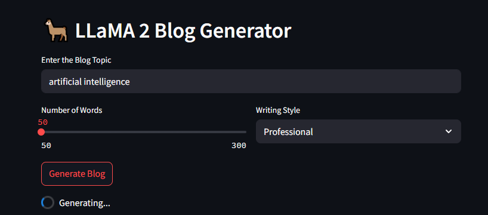

# LLaMA 2 Blog Generator

A lightweight Streamlit application that generates human-like blog content using a locally hosted **LLaMA 2** model. Designed for low-end systems, this project eliminates the need for cloud-based APIs by running entirely on your machine with a quantized `.ggml` model.

---

## 🚀 What It Does

- 📝 Generates blog posts from a topic and selected writing style.
- 🎛️ Customizable word length and tone.
- ⚡ Runs efficiently on low-spec laptops using quantized inference.

---

## 🧠 Technology Stack

- **LLaMA 2 (Quantized)** – Local language model (e.g., `ggmlv3.q8_0.bin`)
- **CTransformers** – For loading and running LLaMA 2 without GPUs
- **LangChain** – Prompt templating and model invocation
- **Streamlit** – Simple UI for topic input and result display

---

## ✅ Use Cases

- 📚 Quick blog drafts for content creators
- 🧪 Experimentation with LLMs
- 🧑‍🎓 Educational tool to learn LLM workflows
- 🔌 API-free solution for writing assistance

---

## 💻 Requirements

- Python 3.9+
- Minimum 8 GB RAM (recommended)
- Local storage for model (~4–5 GB)
- 2 CPU cores (minimum)

---

## Result UI:

